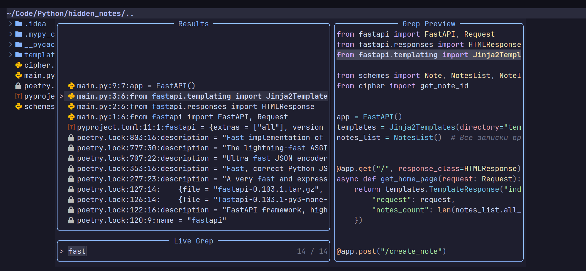
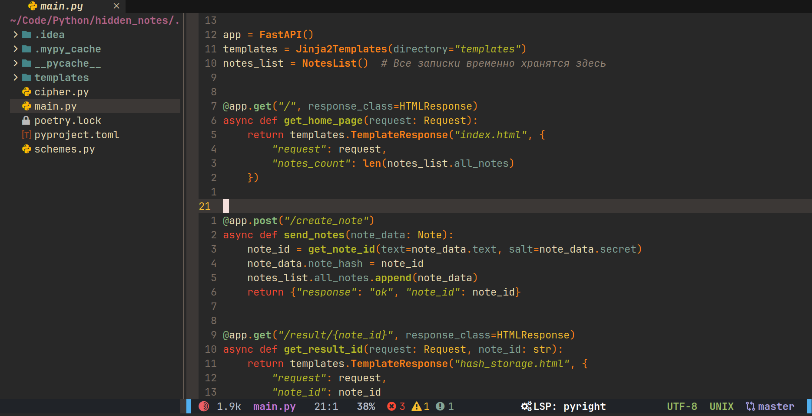

<h1 align="center">GenesisNvim</h1>

<h4 align="center">
  <a href="https://github.com/Zproger/GenesisNvim#-installation">Installation</a>
  ·
  <a href="https://www.youtube.com/@zproger">Youtube</a>
  ·
  <a href="https://t.me/codeblog8">Telegram</a>
</h4>

<p align="center">
A minimalistic nvim config aimed at Python developers. It is a lightweight replacement for PyCharm and VsCode, eliminating all unnecessary featuresd to be easily portable for running on servers and for deployment on Linux systems.
</p>

## 🌟 Preview








## 🌟 What it is?
- There are many forks of nvim, but what does this one do? The main purpose of this config is to create a minimal environment for Python development, so that it is not resource-hungry and can be deployed quickly on Linux systems.
- It can be difficult for beginners to install all the necessary plugins and LSP servers to get started. Here you don't need to do anything, just run a few commands to install and immediately use auto-tips, Ruff formatting, Mypy fixes and all the other tricks without setting up configurations.

## ✨ Features
- Python autocomplete with Pyright by default
- Support for default Ruff formatting and fixing
- Fast startup in just 140ms
- Catalog trees, support for TODO tags, navigation plugins, Git
- Support over 30 color schemes
- Support for diagnostics and LSP by default
- Built-in floating terminal that can be opened separately
- Quick search via Telescope

## 🌟 Installation
- If you already have neovim, make backups of your configuration.
- Remove the current nvim configuration and cache if it exists:

```sh
rm -rf ~/.config/nvim
rm -rf ~/.local/share/nvim
rm -rf ~/.local/state/nvim
rm -rf ~/.cache/nvim
```

- Execute the commands to install:

```sh
sudo pacman -S git npm  # Arch
sudo apt install git npm  # Debian
```

```sh
mkdir -p ~/.config/nvim
git clone https://github.com/Zproger/GenesisNvim.git ~/.config/nvim
nvim -c "MasonInstall pyright ruff-lsp mypy"
```

## 🌟 Other
- The project is ready for development, so I accept all your ideas. You can contact me or open `Issues` to make your edits or suggest improvements.
- To learn the tool key combinations, press `Space`, after the prompt, select the desired menu. To analyze and change key combinations, go to `~/.config/nvim/lua/core` and `~/.config/nvim/lua/plugins`.
